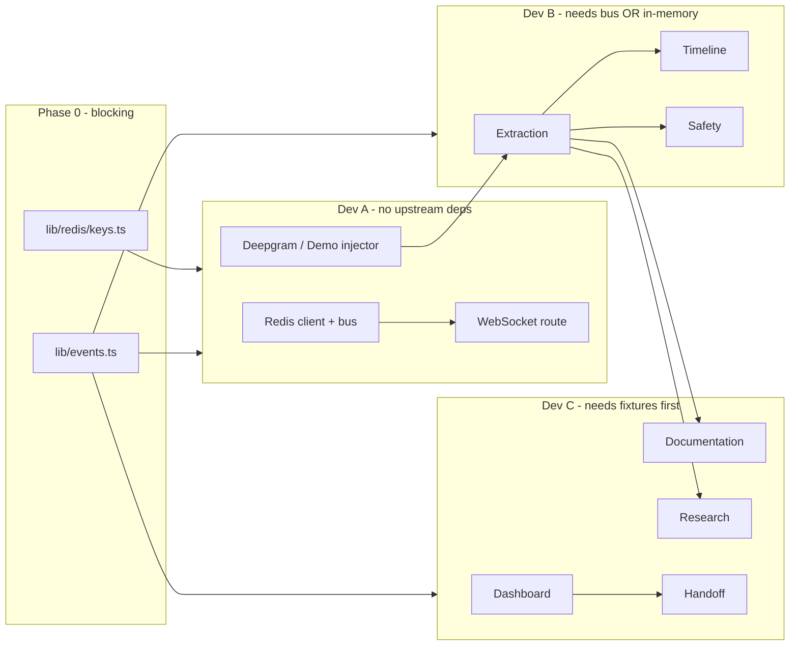

# Parallel Build Guide

> **2-person team?** Start here → [Teammate 1 — Platform](./docs/TEAMMATE_1.md) · [Teammate 2 — Product](./docs/TEAMMATE_2.md)

Build in parallel. **Phase 0 is blocking** — do it together in ~45 minutes. After that, devs rarely touch the same files.

---

## Phase 0 — All hands (45 min)

Do this before splitting up.

| Step | Action | Who |
|------|--------|-----|
| 1 | Clone repo, `npm install` | All |
| 2 | Copy `.env.example` → `.env.local`, fill API keys | All |
| 3 | **Do not edit `lib/events.ts` without group sync** | All |
| 4 | Dev A: spin up Redis (Docker or Redis Cloud free tier) | A |
| 5 | Dev C: `npx create-next-app@latest . --typescript --tailwind --eslint --app --no-src-dir --import-alias "@/*" --use-npm --yes` if `app/` doesn't exist yet | C |
| 6 | Merge: ensure `@/` resolves to repo root | C |
| 7 | Create branch per dev: `dev/a-voice`, `dev/b-agents`, `dev/c-ui` | All |
| 8 | Confirm everyone can import from `@/lib/events` | All |

### Merge strategy

- **Main branch:** only `lib/events.ts`, `lib/redis/keys.ts`, `fixtures/`, integration PRs
- **Feature branches:** each dev works on owned files (see below)
- **Integrate at hours 6, 10, 14** — merge all three branches to `main`, run demo scenario together
- **Never** two devs editing the same file on the same branch

---

## File ownership (no overlap)

```
SHARED (sync required)
  lib/events.ts
  lib/redis/keys.ts
  lib/bus.ts              ← Dev A implements Redis adapter here
  package.json            ← coordinate dependency adds in Slack

DEV A                          DEV B                         DEV C
lib/redis/client.ts            lib/agents/extraction.ts      lib/agents/documentation.ts
lib/redis/publish.ts           lib/agents/timeline.ts        lib/agents/research.ts
lib/agents/transcription.ts    lib/agents/safety.ts          lib/agents/handoff.ts
app/api/ws/route.ts            lib/prompts/extraction.ts     app/page.tsx
app/api/encounter/route.ts     lib/prompts/timeline.ts       app/layout.tsx
scripts/demo-injector.ts       lib/prompts/safety.ts         components/**
scripts/run-local-bus.ts       lib/claude.ts                 hooks/useEncounterEvents.ts
                               lib/debounce.ts
```

---

## Dependency graph



**Key insight:** Dev B and Dev C can start immediately using `createInMemoryBus()` and `fixtures/full-encounter-state.json`. They do not wait for Dev A.

---

## Independent testing (no blockers)

| Dev | Test without others | Command / approach |
|-----|---------------------|-------------------|
| **A** | Publish mock segments to Redis, verify WebSocket receives them | `redis-cli PUBLISH er-copilot:transcript.segment '{...}'` |
| **B** | In-memory bus + demo replay | `npx tsx scripts/run-local-bus.ts` |
| **C** | Render dashboard from fixture JSON | Import `fixtures/full-encounter-state.json` in page, skip WebSocket |

---

## Integration checkpoints

| Hour | Gate | Pass criteria |
|------|------|---------------|
| **6** | Bus live | Demo injector → Redis → WebSocket → browser console logs events |
| **10** | Brain live | Demo scenario → extraction → timeline + safety events in UI |
| **14** | Full pipeline | All 4 dashboard panels update during demo replay |
| **18** | Research + handoff | Citations appear; handoff modal works |
| **22** | Rehearsal | 3 full demo runs without manual fixes |

If a gate fails, **all devs stop feature work** and fix the bus.

---

## API surface (Dev A owns, everyone consumes)

### WebSocket `GET /api/ws`

Browser connects once per session. Server fans out all Redis pub/sub events as JSON:

```json
{ "channel": "timeline.updated", "payload": { ... } }
```

### `POST /api/encounter`

Create or reset encounter. Body: `{ "mode": "live" | "demo" }`

- `demo` → starts `scripts/demo-scenario.json` replay
- Returns `{ "encounterId": "demo-encounter-001" }`

### `POST /api/handoff`

Body: `{ "encounterId": "..." }` → publishes `handoff.requested`

---

## Environment variables

See `.env.example`. Each dev only needs the keys for their track to start locally.

| Variable | Dev |
|----------|-----|
| `REDIS_URL` | A (B/C optional for local in-memory) |
| `DEEPGRAM_API_KEY` | A |
| `ANTHROPIC_API_KEY` | B, C |
| `BROWSERBASE_API_KEY` | C |
| `ARIZE_*` | B (hour 14+) |

---

## Daily sync (5 min)

1. Any changes to `lib/events.ts`?
2. Which integration gate are we targeting?
3. Blockers?
4. Who merges next?

---

## Quick links

- [Teammate 1 — Platform & Pipeline](./docs/TEAMMATE_1.md)
- [Teammate 2 — Agents, UI & Demo](./docs/TEAMMATE_2.md)
- [Dev A — Voice & Bus](./docs/DEV_A.md)
- [Dev B — Clinical Brain](./docs/DEV_B.md)
- [Dev C — Output & UI](./docs/DEV_C.md)
- [Product plan](./ER_Copilot_Hackathon_Plan.md)
