# Nos — System Architecture

> AI Paramedic Copilot — real-time prehospital documentation from scene to hospital handoff.

---

## Table of Contents

1. [Overview](#1-overview)
2. [System Topology](#2-system-topology)
3. [Backend Agents](#3-backend-agents)
4. [Event Bus](#4-event-bus)
5. [Redis Data Model](#5-redis-data-model)
6. [SSE Flow (Backend → Browser)](#6-sse-flow-backend--browser)
7. [Frontend State Machine](#7-frontend-state-machine)
8. [Session Lifecycle](#8-session-lifecycle)
9. [Vision Pipeline](#9-vision-pipeline)
10. [Research Agent](#10-research-agent)
11. [Handoff Flow](#11-handoff-flow)
12. [Demo Injector](#12-demo-injector)
13. [Next.js Proxy](#13-nextjs-proxy)
14. [Docker Compose](#14-docker-compose)
15. [API Route Index](#15-api-route-index)

---

## 1. Overview

Nos is a **Next.js 15 frontend** + **Python FastAPI backend** system. They communicate over two channels:

- **HTTP** — the frontend calls `/api/*` endpoints for commands (start encounter, submit transcript, request handoff, submit camera frame).
- **SSE** — the backend pushes real-time events to the browser as they happen (transcript lines, safety flags, extracted facts, timeline updates).

All AI reasoning happens in the Python backend. The Next.js layer is purely a UI — it proxies every `/api/*` request transparently to Python.

> **Note on legacy code:** A TypeScript backend mirror exists under `lib/` and `legacy-ts-api/`. It is **not used at runtime**. The Python backend is authoritative.

---

## 2. System Topology

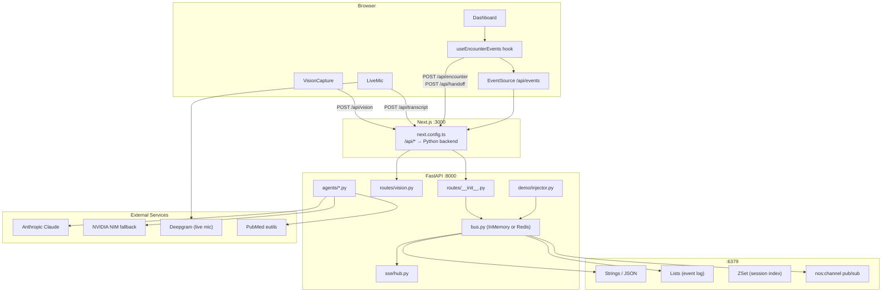

### Key files

| Layer | Path | Role |
|-------|------|------|
| Frontend entry | `app/page.tsx` | Renders `<Dashboard />` |
| Proxy config | `next.config.ts` | Rewrites `/api/*` → FastAPI |
| Backend entry | `backend/main.py` | FastAPI app, CORS, lifespan |
| Event contract | `types/events.ts` + `backend/events.py` | Shared channel names + payload types |
| Session types | `types/session.ts` | `SessionSummary`, `EncounterSnapshot` |

### Environment variables

| Variable | Used by | Purpose |
|----------|---------|---------|
| `REDIS_URL` | Backend | Redis connection (empty = in-memory fallback) |
| `ANTHROPIC_API_KEY` | Backend | Claude calls |
| `NVIDIA_API_KEY` / `NIM_API_KEY` | Backend | LLM fallback |
| `DEEPGRAM_API_KEY` | Backend | Live mic transcription key |
| `PYTHON_BACKEND_URL` | Frontend / Compose | Proxy target (default `http://localhost:8000`) |

---

## 3. Backend Agents

All agents are started once at boot (or on first API request) by `backend/agents/runtime.py` → `ensure_agents_started()`. Each agent subscribes to one or more bus channels and publishes results back.

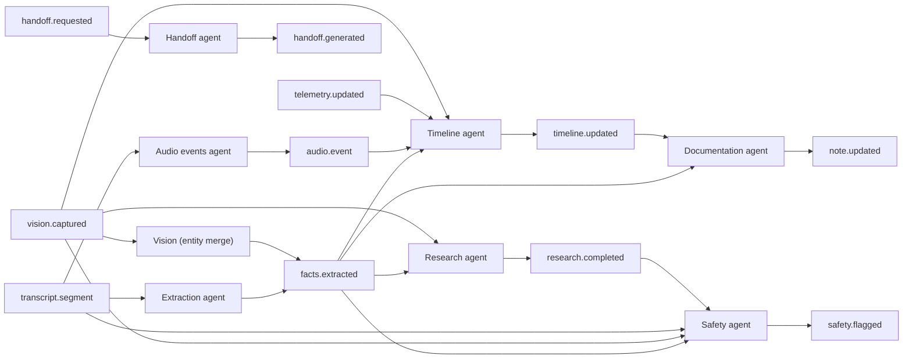

### Agent reference

| Agent | File | Subscribes | Publishes | Key Redis writes |
|-------|------|------------|-----------|-----------------|
| **Extraction** | `backend/agents/extraction.py` | `transcript.segment` | `facts.extracted` | `buffer`, `facts` |
| **Timeline** | `backend/agents/timeline.py` | `facts.extracted`, `audio.event`, `telemetry.updated`, `vision.captured` | `timeline.updated` | `timeline` |
| **Safety** | `backend/agents/safety.py` | `facts.extracted`, `vision.captured`, `transcript.segment`, `research.completed` | `safety.flagged` | `safety`, `nremt-covered`, `active-medications`, `vision-items` |
| **Documentation** | `backend/agents/documentation.py` | `facts.extracted`, `timeline.updated` | `note.updated` | `soap` |
| **Research** | `backend/agents/research.py` | `facts.extracted`, `vision.captured` | `research.completed` | `researched-meds` (set), `research` |
| **Handoff** | `backend/agents/handoff.py` | `handoff.requested` | `handoff.generated` | `handoff` |
| **Vision (merge)** | `backend/agents/vision.py` | `vision.captured` | `facts.extracted` | `facts` |
| **Audio events** | `backend/agents/audio_events.py` | `transcript.segment` | `audio.event` | — |

### LLM wrapper

`backend/claude.py` → `call_claude_json(system, prompt, agent_name)`:
- Primary: Anthropic Claude (Sonnet for safety/handoff, Haiku for timeline/extraction)
- Fallback: NVIDIA NIM (`llama-3.1-70b-instruct`) if no Anthropic key
- Returns parsed JSON or `None` → agents fall back to heuristics

### Debounce timings

| Agent | Delay | Silence cutoff |
|-------|-------|---------------|
| Extraction | 4 000 ms | 1 500 ms |
| Documentation | 8 000 ms | — |
| Safety LLM re-run | 2 000 ms | 1 000 ms |

---

## 4. Event Bus

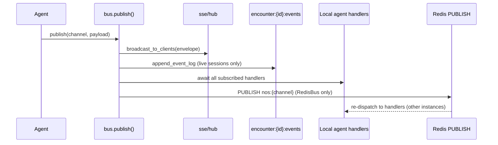

### Channels

| Constant | Channel string | Published by |
|----------|---------------|-------------|
| `TRANSCRIPT_SEGMENT` | `transcript.segment` | routes, demo injector |
| `FACTS_EXTRACTED` | `facts.extracted` | extraction, vision merge |
| `TIMELINE_UPDATED` | `timeline.updated` | timeline agent |
| `SAFETY_FLAGGED` | `safety.flagged` | safety agent |
| `NOTE_UPDATED` | `note.updated` | documentation agent |
| `RESEARCH_COMPLETED` | `research.completed` | research agent |
| `HANDOFF_REQUESTED` | `handoff.requested` | routes |
| `HANDOFF_GENERATED` | `handoff.generated` | handoff agent |
| `AUDIO_EVENT` | `audio.event` | audio events agent, demo injector |
| `TELEMETRY_UPDATED` | `telemetry.updated` | routes, demo injector |
| `VISION_CAPTURED` | `vision.captured` | vision route, demo injector |

### Envelope shape

```json
{
  "channel": "safety.flagged",
  "payload": {
    "encounterId": "abc-123",
    "concern": "...",
    "severity": "high",
    "rationale": "...",
    "flaggedAt": "2026-06-21T..."
  }
}
```

Every payload includes `encounterId`.

### Bus implementations

| Class | When active | Extra behaviour |
|-------|-------------|----------------|
| `InMemoryBus` | No `REDIS_URL` or Redis ping fails | Local handler dict only |
| `RedisBus` | `REDIS_URL` set and healthy | Same + Redis `PUBLISH`/`SUBSCRIBE` for multi-instance |

`publish()` order (both buses):
1. SSE fan-out → browser
2. Event log append (live sessions only)
3. Local agent handlers (direct, zero-latency)
4. *(RedisBus)* Redis `PUBLISH` → subscriber re-dispatches to local handlers on other instances

---

## 5. Redis Data Model

Key definitions: `backend/redis_layer/keys.py`
CRUD helpers: `backend/redis_layer/state.py`

### Global keys

| Key | Type | Purpose |
|-----|------|---------|
| `nos:active-session` | String | Current active encounter ID |
| `nos:sessions` | Sorted Set (score = start ms) | Ordered session index for `/api/sessions` |

### Per-encounter keys — `encounter:{encounterId}:{suffix}`

| Suffix | Redis type | Writer(s) | Contents |
|--------|-----------|-----------|---------|
| `meta` | JSON string | session lifecycle functions | `{mode, status, createdAt?, startedAt?, endedAt?}` |
| `start-time` | String (ISO) | `register_session` | Encounter start timestamp |
| `transcript` | String (newline-delimited) | `append_transcript_line` | `[speaker] text` lines |
| `transcript-lines` | JSON array | `append_transcript_line` | `[{speaker, text, timestamp}]` — structured form |
| `buffer` | String | extraction agent debouncer | Pending text chunks awaiting extraction |
| `facts` | JSON | extraction, vision merge, safety | `MedicalEntities` (meds, allergies, vitals, …) |
| `timeline` | JSON array | timeline agent | `TimelineEntry[]` |
| `safety` | JSON array | safety agent `_fire_flag` | Historical flag objects |
| `soap` | JSON | documentation agent | `SoapNote` (S/O/A/P) |
| `research` | JSON array | research agent | Research result objects with citations |
| `researched-meds` | Set | `add_to_set` | Dedup keys `{type}:{entity}` |
| `handoff` | JSON | handoff agent | `HandoffReport` |
| `nremt-covered` | JSON object | safety agent | Boolean checklist per NREMT item |
| `vision-items` | JSON array | safety agent | `{identified, captureType}` objects |
| `active-medications` | JSON array | safety agent | `{name, source, recordedAt}` |
| `events` | List (RPUSH) | `append_event_log` via bus | `{channel, payload, at}` audit trail |

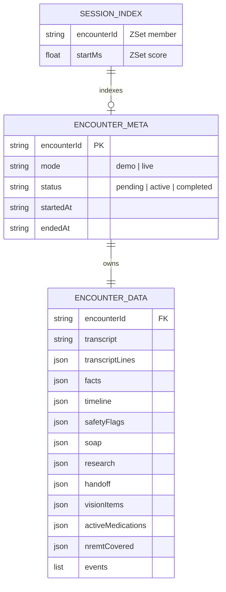

**In-memory fallback:** When Redis is unavailable, `_memory_store`, `_memory_lists`, and `_memory_zsets` dicts mirror the same key patterns in process memory.

---

## 6. SSE Flow (Backend → Browser)

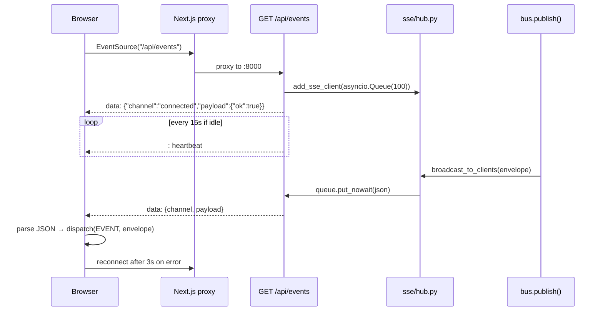

**Client filtering:** The hook ignores events where `payload.encounterId` differs from the active session — prevents stale demo events bleeding into a new live session.

**Replay mode** (`/logs/[encounterId]`): No SSE connection is opened. State is populated via a single `GET /api/sessions/{id}` snapshot fetch.

---

## 7. Frontend State Machine

**Hook:** `hooks/useEncounterEvents.ts`
**Reducer:** pure function `(EncounterState, Action) → EncounterState`

### State shape

```typescript
interface EncounterState {
  encounterId: string;
  startedAt: string | null;
  connected: boolean;
  transcript: TranscriptLine[];   // includes "console" vision lines
  entities: MedicalEntities | null;
  timeline: TimelineEntry[];
  safetyFlags: SafetyFlaggedPayload[];
  soap: SoapNote | null;
  research: ResearchEntry[];
  handoff: HandoffReport | null;
  visionItems: VisionItem[];
  phase: "idle" | "scene" | "en_route" | "hospital";
  mode: "idle" | "demo" | "live";
  loading: boolean;
  activeAgents: Set<string>;
}
```

### Actions

| Action type | Triggered by | Effect |
|-------------|-------------|--------|
| `CONNECTED` / `DISCONNECTED` | EventSource open/error | `connected` flag |
| `SET_ENCOUNTER` | `startEncounter()` response | Reset state, set new ID + startedAt |
| `HYDRATE` | Snapshot fetch on mount or replay | Populate all fields from Redis snapshot |
| `RESET` | `startEncounter()` pre-flight | Clear data, keep connection metadata |
| `SET_MODE` | Encounter start | `mode` |
| `SET_LOADING` | Encounter start, handoff | `loading` |
| `AGENT_ACTIVE` / `AGENT_IDLE` | SSE event in / 2.5s timeout | Activity strip dots |
| `EVENT` | Every SSE message | `applyEvent()` below |

### Event → state mapping

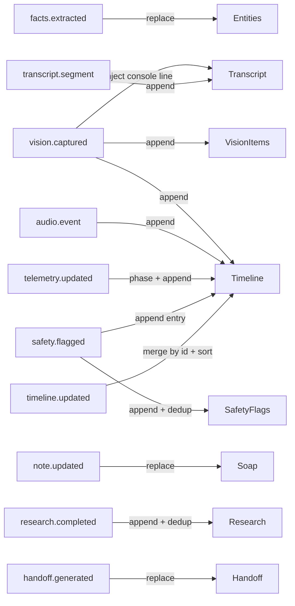

### Panel wiring (Dashboard.tsx)

| Component | State slice |
|-----------|------------|
| `TranscriptPanel` | `state.transcript` |
| `TimelinePanel` | `state.timeline` |
| `InsightsPanel` | `safetyFlags`, `research`, computed `missingInfo`, `suggestedFollowUps` |
| `SoapPanel` | `state.soap` |
| `VisionCapture` | `encounterId`, `visionItems`, `active` |
| `SafetyAlertBanner` | `safetyFlags`, `entities` |
| `HandoffModal` | `transcript`, `handoff`, `loading` |
| Entity chips bar | `state.entities` |
| Agent activity strip | `state.activeAgents` |
| `TelemetryBar` | `state.phase` |

---

## 8. Session Lifecycle

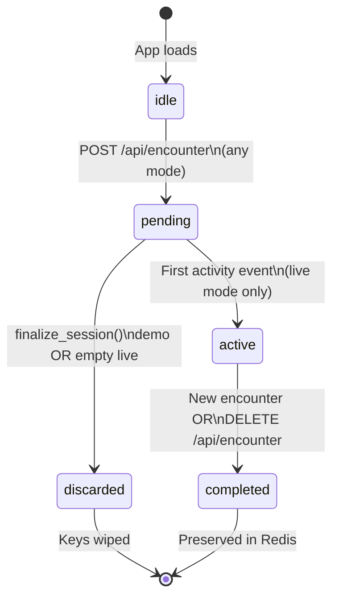

### Status meanings

| Status | Set by | In session index? | Snapshot accessible? |
|--------|--------|:-----------------:|:--------------------:|
| `pending` | `start_pending_session()` | No | No |
| `active` | `register_session()` via `ensure_session_saved()` | Yes | Yes |
| `completed` | `complete_session()` | Yes | Yes |
| *(demo)* | `start_pending_session()` mode=demo | Never | Never |

### Activity channels (promote pending → active)

`transcript.segment`, `vision.captured`, `telemetry.updated`, `audio.event`, `facts.extracted`, `timeline.updated`, `safety.flagged`, `note.updated`, `research.completed`, `handoff.generated`

### Lifecycle triggers

| Trigger | Action |
|---------|--------|
| `POST /api/encounter` | `finalize_active_session()` → start new UUID + `start_pending_session()` |
| `DELETE /api/encounter` | `finalize_session()` on named encounter |
| First bus event on live session | `ensure_session_saved()` → `register_session()` → added to ZSet |
| Backend boot (Redis available) | `purge_all_demo_sessions()` — removes any lingering demo keys |

### Session log pages

- `GET /api/sessions` — ZSet reverse order, skips `mode == "demo"` entries
- `GET /api/sessions/{id}` — full snapshot (returns 404 for pending/demo)
- `/logs` — `SessionLogList` component, links to session detail
- `/logs/[encounterId]` — full `<Dashboard replayEncounterId={...} />`, read-only

---

## 9. Vision Pipeline

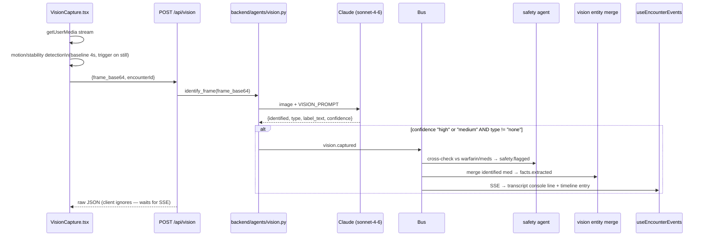

### Capture triggers (VisionCapture.tsx)

| Trigger | Condition |
|---------|-----------|
| **Baseline interval** | Every 4 s (fallback) |
| **Stability trigger** | Motion drops to near-zero after movement |
| **Sustained hold re-capture** | Object steady > 3 s → every 2 s while held |

All paths share a 1 500 ms minimum gap between actual POSTs (`MIN_POST_INTERVAL_MS`).

**Gate:** `confidence in ("high", "medium") AND type != "none"` before publishing.

**Prompt output shape:**
```json
{ "identified": "aspirin 325mg", "type": "medication", "label_text": "aspirin 325mg", "confidence": "high" }
```

**Replay mode:** `VisionCapture` is hidden; captured items shown as a static list from the session snapshot.

---

## 10. Research Agent

**File:** `backend/agents/research.py`

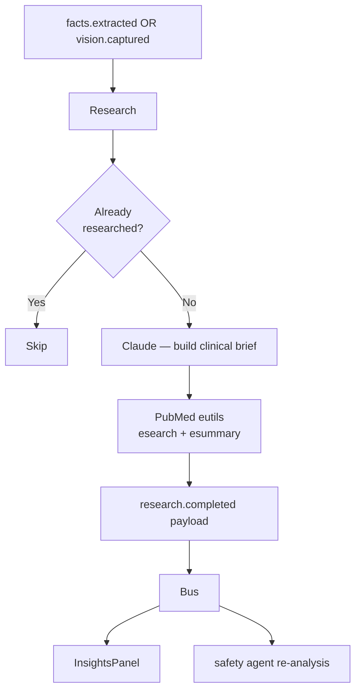

### What gets researched

| Trigger entity | Example query |
|---------------|--------------|
| New medication | `"warfarin aspirin interaction bleeding risk"` |
| Allergy | `"penicillin allergy cross-reactivity cephalosporin"` |
| High-risk condition | `"chest pain prehospital ACS guideline"` |
| Vision-identified med | `"aspirin 325mg warfarin interaction"` |

**Dedup key:** `researched-meds` Redis set, keyed as `medication:warfarin`, `allergy:penicillin`, etc.

**Citations:** PubMed eutils (`esearch` → `esummary` → article titles + URLs). Falls back to a generic search URL if no results.

> **Browserbase note:** `backend/browserbase.py` implements `browserbase_search()` for web-scraping but is **not yet wired** into the research agent. The current path is PubMed-only.

---

## 11. Handoff Flow

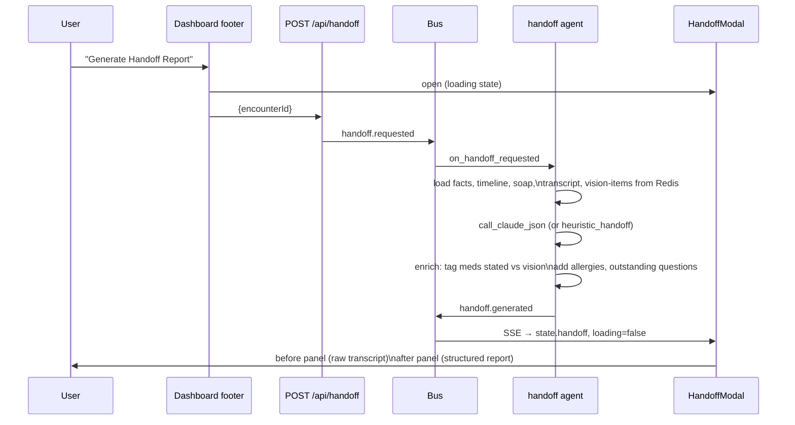

### Handoff report fields

```typescript
interface HandoffReport {
  patientSummary: string;
  allergies: string[];          // prominent — used for ED alert
  timeline: TimelineEntry[];
  currentMedications: Medication[];  // source: "stated" | "vision"
  outstandingQuestions: string[];
  recommendedActions: string[];
  generatedAt: string;
}
```

**Replay:** In read-only mode the "View Handoff Report" button opens the modal with the already-stored report from the snapshot.

---

## 12. Demo Injector

**File:** `backend/demo/injector.py`
**Scenario:** `scripts/demo-scenario.json`

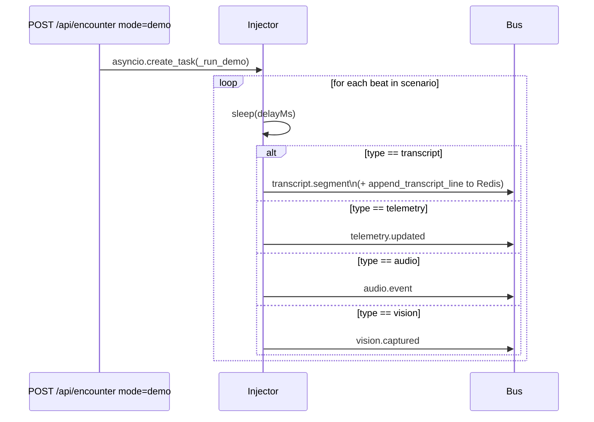

### Beat types

| Beat `type` | Bus channel | Example data |
|------------|------------|-------------|
| `transcript` | `transcript.segment` | `{speaker: "paramedic", text: "…"}` |
| `telemetry` | `telemetry.updated` | `{event: "en_route", label: "County General, ETA 8 min"}` |
| `audio` | `audio.event` | `{event: "monitor_tone", detail: "12-lead ECG acquisition"}` |
| `vision` | `vision.captured` | `{identified: "aspirin 325mg", captureType: "vial_label"}` |

**Abort:** `stop_demo(encounter_id)` sets an `asyncio.Event`; injector checks it between beats.

**Demo sessions** are never saved — `ensure_session_saved()` returns `False` for `mode == "demo"`, events are not written to the event log, and `finalize_session()` calls `discard_session()`.

---

## 13. Next.js Proxy

```typescript
// next.config.ts
const PYTHON_BACKEND = process.env.PYTHON_BACKEND_URL ?? "http://localhost:8000";

rewrites: [
  { source: "/api/:path*", destination: `${PYTHON_BACKEND}/api/:path*` }
]
```

All `fetch("/api/…")` calls and `EventSource("/api/events")` from the browser are forwarded transparently to the Python backend. The browser never talks to Python directly.

**CORS:** FastAPI allows `http://localhost:3000` and `http://127.0.0.1:3000`.

**No Next.js API routes** — `app/api/` does not exist. `legacy-ts-api/` contains mirror stubs that are not served.

---

## 14. Docker Compose

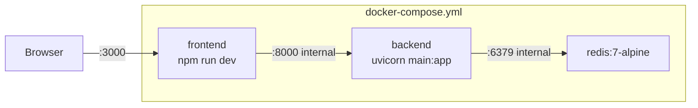

| Service | Build | Ports | Depends on | Key overrides |
|---------|-------|-------|------------|---------------|
| `redis` | `redis:7-alpine` | 6379:6379 | — | volume `redis_data` (persistent) |
| `backend` | `./backend/Dockerfile` | 8000:8000 | `redis` (healthy) | `REDIS_URL=redis://redis:6379` (ignores `.env`) |
| `frontend` | root `Dockerfile` | 3000:3000 | `backend` | `PYTHON_BACKEND_URL=http://backend:8000`, `REDIS_URL=` (empty) |

**Volume mounts:**
- Backend: `./backend:/app`, `./scripts:/scripts:ro` (scenario JSON)
- Frontend: `.:/app`, anonymous volumes for `node_modules` and `.next`

**Redis persistence:** The `redis_data` named volume survives `docker compose down`. Use `docker compose down -v` to wipe sessions along with containers.

---

## 15. API Route Index

All routes defined in `backend/routes/__init__.py` unless noted.

| Method | Path | Purpose |
|--------|------|---------|
| `GET` | `/api/status` | Health check — Redis, Anthropic, Deepgram, Browserbase |
| `GET` | `/api/deepgram` | Return Deepgram key to live mic component |
| `GET` | `/api/events` | SSE stream — persistent connection, 15 s heartbeat |
| `POST` | `/api/encounter` | Start new session (UUID), optionally kick off demo |
| `GET` | `/api/encounter` | Check if demo is currently running |
| `DELETE` | `/api/encounter` | Finalize (complete or discard) the named session |
| `GET` | `/api/sessions` | List archived sessions sorted newest-first |
| `GET` | `/api/sessions/{encounterId}` | Full snapshot for log replay |
| `POST` | `/api/transcript` | Append a spoken line (live mode / manual) |
| `POST` | `/api/handoff` | Trigger handoff report generation |
| `POST` | `/api/audio-event` | Manual audio event stub (live mode) |
| `POST` | `/api/telemetry` | Manual telemetry event stub (live mode) |
| `POST` | `/api/vision` | Submit camera frame → Claude vision → `vision.captured` |

---

## Appendix: Notable Known Gaps

| Item | Status |
|------|--------|
| `lib/` TypeScript backend | Present in repo, **not used at runtime** |
| `backend/routes.py` | Older duplicate router — active router is `backend/routes/__init__.py` |
| Browserbase | Implemented in `backend/browserbase.py`, **not called** by research agent |
| `symptom-timestamps` Redis key | Defined in `keys.py`, **never written** |
| `audio_events` silence monitor | `on_encounter` handler defined but never subscribed; silence detection only fires after transcript activity |
